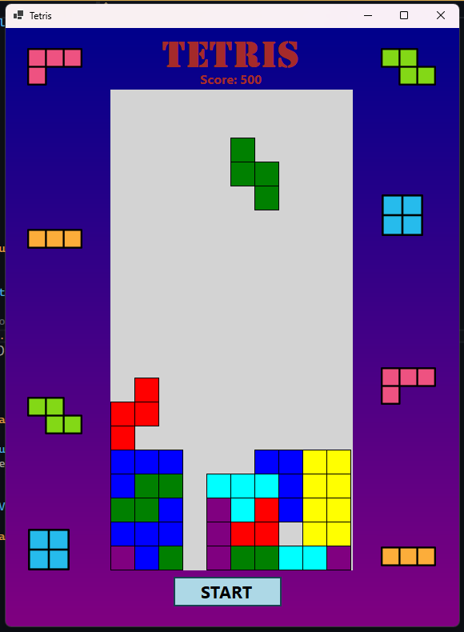
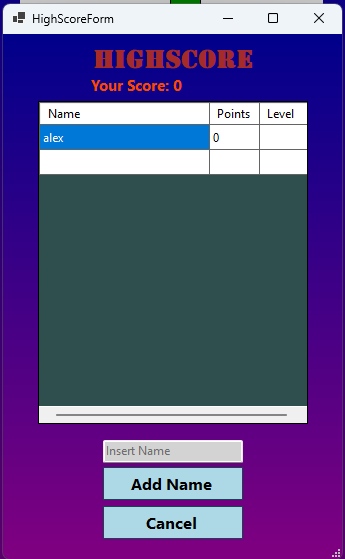

# Tetris Game

A classic Tetris game built with C# and Windows Forms, featuring sound effects, a high-score system, and a vibrant user interface.

---

## Features

- **Dynamic Gameplay**: Randomly generated tetrominoes fall onto a grid.
- **Score System**: Scores are awarded for clearing rows, with increasing difficulty as the game progresses.
- **High Scores**: Keep track of the top 10 high scores with the ability to add your name.
- **Music and Sound Effects**: Enjoy background music and sound effects for interactions.
- **Restart Functionality**: Restart the game easily after a game-over.

---

## Screenshot

---

## How to Play

1. **Start the Game**: Click the "Start" button to begin.
2. **Move the Tetromino**:
   - **Left Arrow**: Move the tetromino left.
   - **Right Arrow**: Move the tetromino right.
   - **Up Arrow**: Rotate the tetromino.
   - **Down Arrow**: Speed up the fall.
   - **Spacebar**: Drop the tetromino immediately.
3. **Clear Rows**: Complete horizontal rows to score points and advance levels.
4. **Game Over**: The game ends if tetrominoes stack to the top. Enter your name in the high-score form if you achieve a top score!

---

